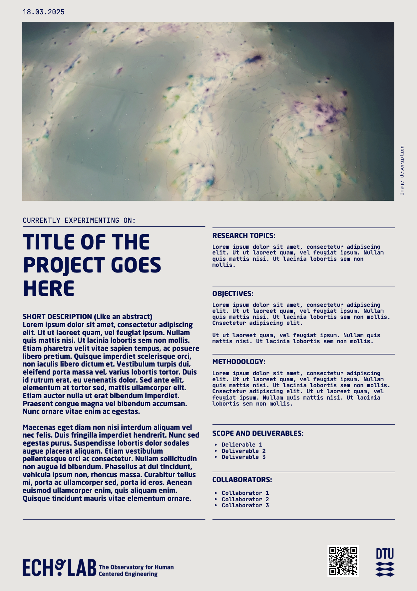
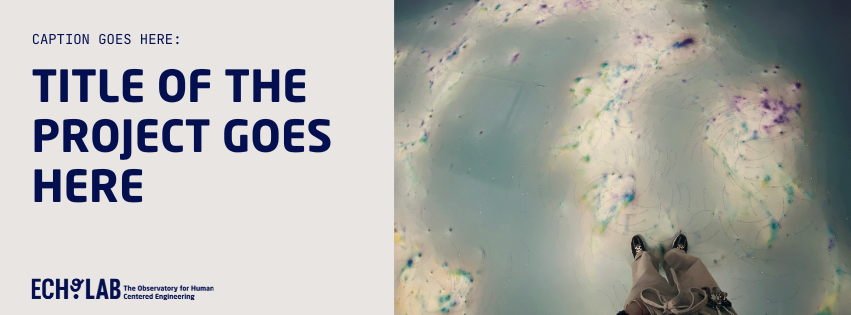

# Templates to showcase & announce projects

We want to make it easy for you to share projects done with ECHO lab. To help you get started, we've put together a some templates you can use: 

To announce upcoming projects or workshops:

**2. Lab announcements**: use this template when there is a new event you want to announce. 
Link: https://www.canva.com/design/DAGi0TXkpPs/qWj_RFDWjdd0QueTIwKMpQ/edit

To share finished projects or workshops:

**1. PDF Project Note template**: use this template showcase projects in the Echolab Github page or print them as posters.
Link: https://www.canva.com/design/DAGiE7cdJk0/MKpu563zHkc2bITMBoH0tA/edit

**3. GitHub README.md Template and Guide**: Below, you'll find a guide and template for a README.md file that you can copy and customize to showcase your projects developed with ECHO Lab. You can do pages like this one:  https://github.com/ECHOlab-DTU/Experimenting-with-large-ethnographic-data-workshop

# GitHub README.md - How to create a new file:  

### STEP 1: Create a New Repository  
- Go to [GitHub](https://github.com), log in to ECHOlab account and click "New repository".  
- Add the repository details (name, description, etc.).  

**Check the box** that says **"Add a README file"**.  

### STEP 2: Edit the README on GitHub  
- Open the repository.  
- Click on `README.md`.  
- Click the pencil icon to edit.
- Copy the content of this readme file below, paste it in and replace the placeholder text with your project details.

**Resources**

- For creating Header images: https://www.canva.com/design/DAGiFLr-UVA/noVd_VitoC5EiZEz8TRrUw/edit
- For styling content: you can check this Markdown guide for tips: https://www.markdownguide.org/basic-syntax/

### STEP 3: Save Your Changes  
- Scroll down and click **"Commit changes"** (the green button on the top right corner)

✅ Done! Your repository now has a structured README.md. 

## Copy the content below the line:
---

# Project title
Add a short description of the project here. A concise overview of the project's purpose and what it aims to solve.

You can also add documents like pdfs: 
[Link Text](Project_Description.pdf)

---  
## Section 1

### Step 1: Title
Lorem ipsum dolor sit amet, consectetur adipiscing elit. Ut ut laoreet quam, vel feugiat ipsum. Nullam quis mattis nisi. Ut lacinia lobortis sem non mollis.  Cnsectetur adipiscing elit. 

### Step 2: Title
Lorem ipsum dolor sit amet, consectetur adipiscing elit. Ut ut laoreet quam, vel feugiat ipsum. Nullam quis mattis nisi. Ut lacinia lobortis sem non mollis.  Cnsectetur adipiscing elit. 

---  
## Section 2

Lorem ipsum dolor sit amet, consectetur adipiscing elit. Ut ut laoreet quam, vel feugiat ipsum. Nullam quis mattis nisi. Ut lacinia lobortis sem non mollis.  Cnsectetur adipiscing elit. 

---  
## Contributors/Acknowledgements:

---
## Contact: 

apuun@dtu.dk 
sarfe@dtu.dk

